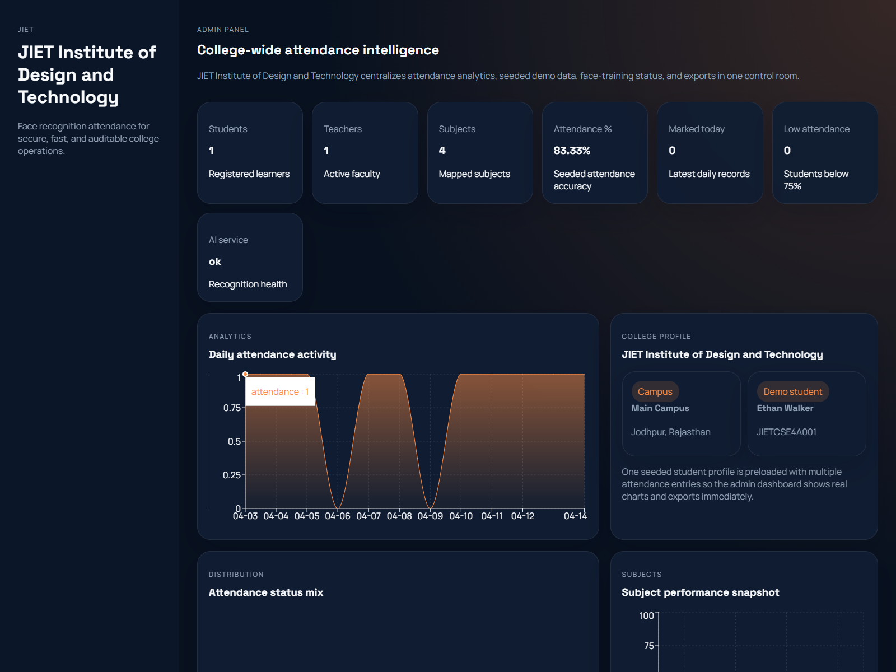
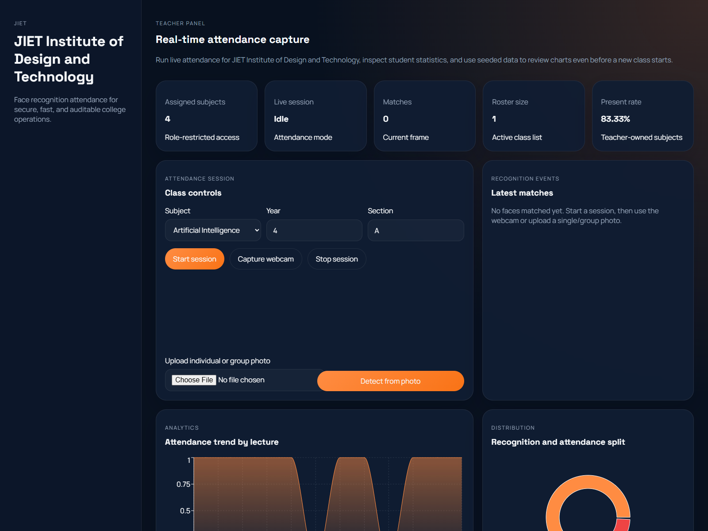

# AI-Face-Attendance-System

AI-powered face recognition attendance platform for colleges with separate admin, teacher, and student dashboards.

[](LICENSE)
[](client/)
[](server/)
[](ai-service/)
[](#local-setup)

## Overview

This project combines a React frontend, Node.js/Express API, MongoDB database, and FastAPI-based face recognition service to automate classroom attendance.

It supports:

- role-based dashboards for admin, teacher, and student users
- face-based attendance marking with manual override
- attendance analytics, reports, and history tracking
- low-attendance email alerts
- seeded demo accounts for quick testing

## Screenshots

### Admin Dashboard



### Teacher Dashboard



### Student Dashboard


## Features

| Module | Highlights |
|---|---|
| Admin | Dashboard analytics, attendance records, student creation, face dataset training, export support |
| Teacher | Subject-wise access, live attendance session, webcam/photo capture, manual override |
| Student | Attendance percentage, subject breakdown, attendance log, prediction view |
| AI Service | Face detection, embedding-based matching, liveness score, multi-face recognition |
| Security | JWT auth, role-based access control, validation, audit-ready flow |

## Tech Stack

| Layer | Technology |
|---|---|
| Frontend | React, Vite, Axios, Recharts |
| Backend | Node.js, Express, Mongoose, JWT |
| AI Service | FastAPI, Python |
| Database | MongoDB |
| Utilities | Nodemailer, PDF export, CSV export |

## Project Structure

```text
.
|-- ai-service/
|   |-- app/
|   |   |-- core/
|   |   |-- models/
|   |   `-- routes/
|   |-- storage/
|   |-- Dockerfile
|   `-- requirements.txt
|-- client/
|   |-- src/
|   |   |-- api/
|   |   |-- app/
|   |   |-- components/
|   |   |-- features/
|   |   |-- lib/
|   |   |-- pages/
|   |   `-- styles/
|   |-- Dockerfile
|   `-- package.json
|-- server/
|   |-- src/
|   |   |-- config/
|   |   |-- controllers/
|   |   |-- jobs/
|   |   |-- middleware/
|   |   |-- models/
|   |   |-- routes/
|   |   |-- services/
|   |   |-- utils/
|   |   `-- validators/
|   |-- Dockerfile
|   `-- package.json
|-- docs/
|   `-- screenshots/
|-- docker-compose.yml
`-- README.md
```

## Demo Credentials

Run `npm run seed` inside `server`, then log in with:

- Admin: `admin@college.edu` / `Admin@123`
- Teacher: `teacher@college.edu` / `Teacher@123`
- Student: `student@college.edu` / `Student@123`

## Local Setup

### 1. Server

```bash
cd server
cp .env.example .env
npm install
npm run seed
npm run dev
```

On Windows PowerShell, copy env with:

```powershell
Copy-Item .env.example .env
```

### 2. AI Service

```bash
cd ai-service
python -m venv .venv
.venv\Scripts\activate
pip install -r requirements.txt
copy .env.example .env
uvicorn app.main:app --reload --port 8000
```

### 3. Client

```bash
cd client
copy .env.example .env
npm install
npm run dev
```

## Docker Setup

```bash
docker compose up --build
```

## API Highlights

- `POST /api/auth/login`
- `GET /api/auth/me`
- `GET /api/admin/dashboard`
- `POST /api/admin/students`
- `POST /api/admin/students/:studentId/faces`
- `POST /api/teacher/attendance/session`
- `POST /api/teacher/attendance/session/:sessionId/recognize`
- `PATCH /api/teacher/attendance/session/:sessionId/manual`
- `PATCH /api/teacher/attendance/session/:sessionId/stop`
- `GET /api/student/:studentId/attendance/overview`
- `GET /api/student/:studentId/attendance/prediction`

## Email Configuration

Set these values in `server/.env`:

- `SMTP_HOST`
- `SMTP_PORT`
- `SMTP_USER`
- `SMTP_PASS`
- `SMTP_FROM`

Gmail usually requires an app password instead of the main account password.

## Face Recognition Notes

- Embeddings are stored through the server, not raw image archives.
- Teachers can mark attendance using webcam capture or uploaded images.
- Multiple face images can be used to build the seeded student profile.
- The current liveness check is lightweight and can be replaced for higher-security deployments.

## Deployment Notes

- Frontend: Vercel or Netlify
- Backend: Render, Railway, AWS Elastic Beanstalk, or ECS
- AI Service: Render, EC2, or ECS
- Database: MongoDB Atlas

## Testing Flow

1. Seed the database.
2. Log in as admin and review the analytics dashboard.
3. Log in as teacher and start an attendance session.
4. Capture attendance by webcam or photo.
5. Stop the session and verify the records.
6. Log in as student and review updated attendance logs.
7. Export reports as CSV or PDF.

Additional sample guidance is in [docs/sample-dataset.md](docs/sample-dataset.md).

## License

This repository, `AI-Face-Attendance-System`, is licensed under the MIT License. See [LICENSE](LICENSE).
